# Guia Visual do Nosso Sistema de Gestão

Olá! Preparei este documento para te apresentar, de forma bem visual e prática, como funciona a nossa ferramenta de gestão de clientes.

A ideia aqui não é falar de códigos ou termos técnicos complicados, mas sim mostrar como o sistema ajuda a organizar nossa empresa, facilitar as vendas e dar a você, gestor, o controle que precisa no dia a dia.

Vamos fazer um tour pelas principais telas?

---

## 1. A Porta de Entrada (Login)

Tudo começa aqui. Esta é a nossa tela de segurança. Ela garante que apenas as pessoas autorizadas da nossa equipe tenham acesso às informações estratégicas da empresa. É simples: colocou o e-mail e a senha, entrou.

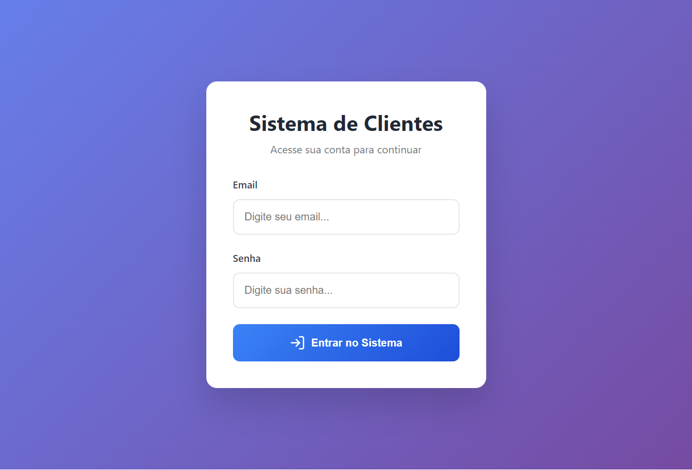

---

## 2. O Painel de Controle (Dashboard)

Assim que entramos, caímos nesta tela principal. Pense nela como o painel do seu carro: você bate o olho e já sabe se está tudo correndo bem.

Aqui você vê a lista de todos os nossos clientes e, o mais importante, em que pé está cada negociação. As cores ajudam muito:
*   **Verde:** Negócio fechado!
*   **Amarelo/Laranja:** Estamos negociando.
*   **Azul:** Estamos começando a conversar (prospecção).

---

## 3. A "Ficha Completa" do Cliente

Quando você clica em um cliente na lista anterior, o sistema abre esta tela. É como se fosse a pasta física do cliente, mas digital e muito mais organizada.

Aqui temos tudo:
*   Quem é o contato lá dentro.
*   O histórico de tudo o que já conversamos (para ninguém ficar perdido se trocar de vendedor).
*   As propostas que enviamos.

É a memória da nossa relação com eles.

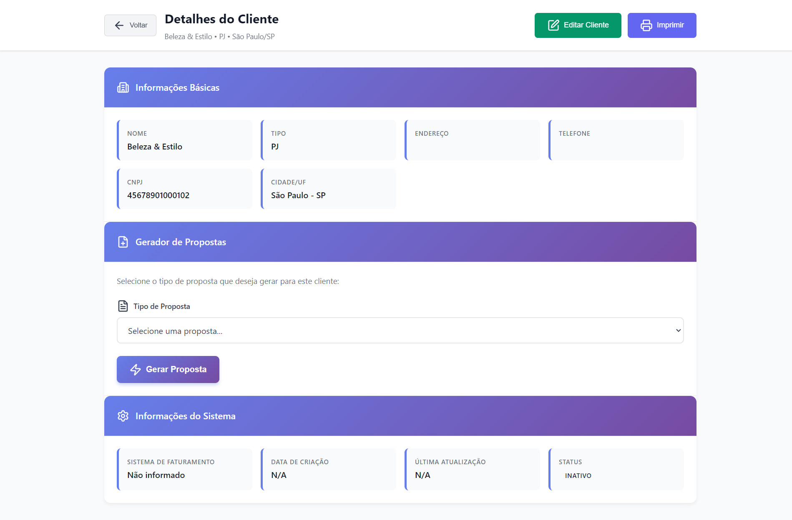

---

## 4. O Placar de Vendas (Gestão de Vendedores)

Para a gestão, esta talvez seja a tela mais importante. Aqui nós acompanhamos o desempenho do time comercial.

O sistema monta um ranking automático mostrando:
*   Quem está vendendo mais.
*   Quem está trazendo mais clientes novos.
*   Como está a meta de cada um.

É excelente para dar feedbacks baseados em números reais, e não em "achismos".

---

## 5. Organizando o Time (Gestão de Equipe)

Aqui é onde a gente "arruma a casa". Nesta tela, definimos quem faz parte da equipe, quem é vendedor, quem é gerente, e quais clientes cada um vai atender. É o centro de comando dos recursos humanos do setor comercial.

---

## 6. Nosso Canal de Avisos (Comunicação)

Sabe aquela confusão de avisos perdidos em grupos de WhatsApp ou e-mails que ninguém lê? Tentamos resolver isso aqui.

Temos um mural de avisos dentro do próprio sistema. Se tem uma meta nova, um aviso de feriado ou uma mudança importante, fica registrado aqui para todo mundo ver assim que começar a trabalhar.

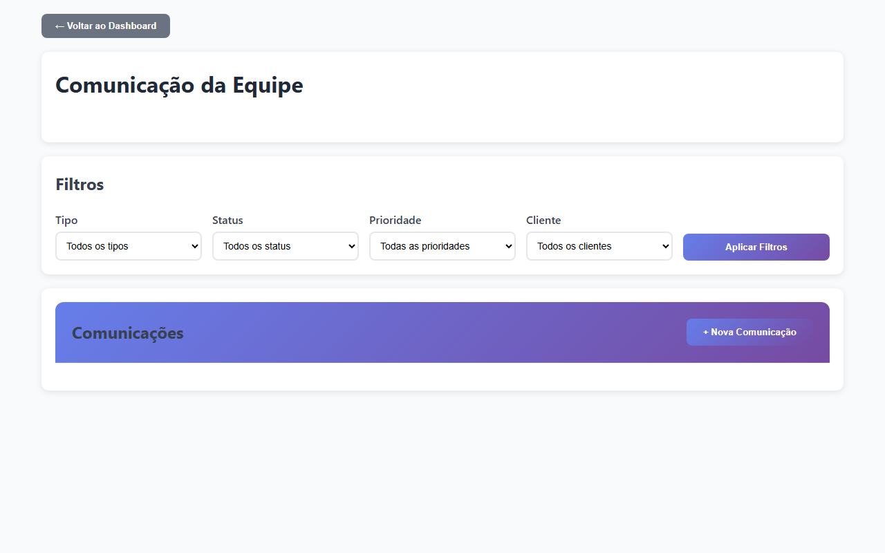

---

## 7. O "Sinal Verde" (Liberações e Etapas)

Para garantir que nenhum erro aconteça, criamos esta tela de aprovações.

Se um vendedor precisa dar um desconto maior que o padrão ou avançar um cliente para uma etapa crítica, o sistema "trava" e pede a sua autorização aqui. É o seu controle de qualidade para garantir que as regras comerciais sejam seguidas.

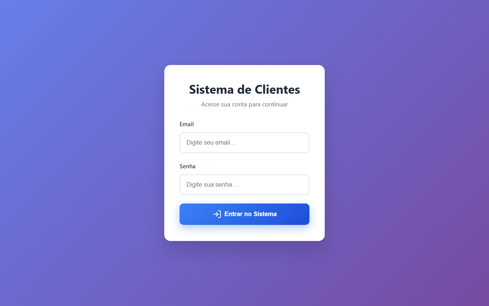

---

## 8. Buscando Novas Oportunidades (Inteligência)

Aqui é onde a mágica acontece para trazer dinheiro novo. Temos duas ferramentas poderosas:

### Busca em Editais Públicos (PNCP)
O sistema varre o portal do governo para encontrar editais e licitações que tenham a ver com o que vendemos. É oportunidade chegando pronta para a gente.

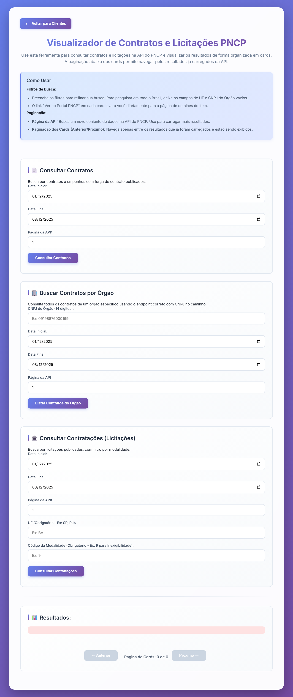

### Nossa Inteligência Artificial (Gemini)
Esta é a nossa "assistente virtual inteligente". Você diz para ela: "Procure escolas em São Paulo", e ela não só traz a lista, como já sugere o texto do e-mail para enviarmos. Ela ajuda o vendedor a perder menos tempo pesquisando e mais tempo vendendo.

---

## Resumo

Nosso sistema foi desenhado para ser o braço direito da equipe. Ele tira a burocracia da frente para que os vendedores possam vender e para que você, gestor, tenha os números na mão para tomar decisões rápidas e seguras.

---

## Demonstração Prática: Um Caso de Uso Real

Para que você veja como tudo isso funciona na prática, simulei um cenário real: **prospectar uma escola da Bahia usando nossa IA e transformá-la em cliente**.

### Passo 1: Acessando a Busca Inteligente
Aqui começamos nossa prospecção. A tela da IA Gemini é clean e direta ao ponto.

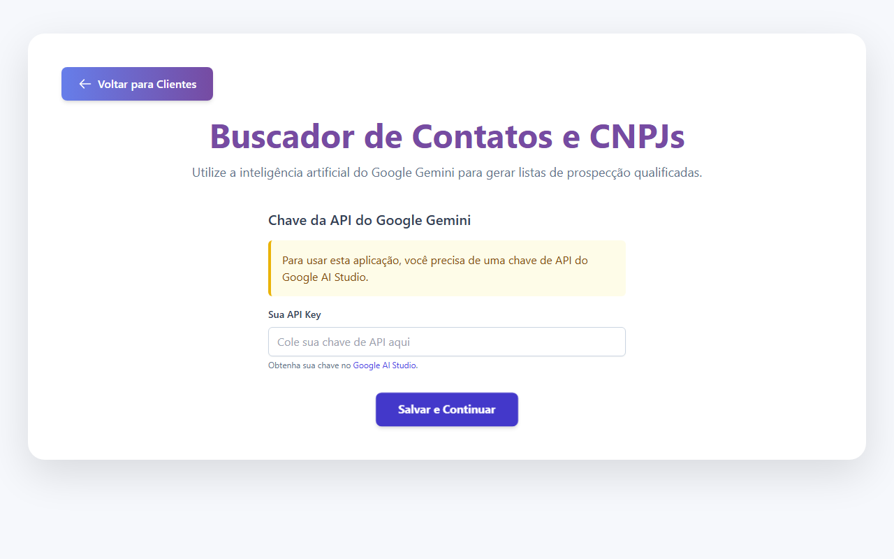

### Passo 2: Configurando a Inteligência
Inserimos a chave da API para ativar nossa "assistente virtual". Uma vez configurado, não precisa mais mexer.

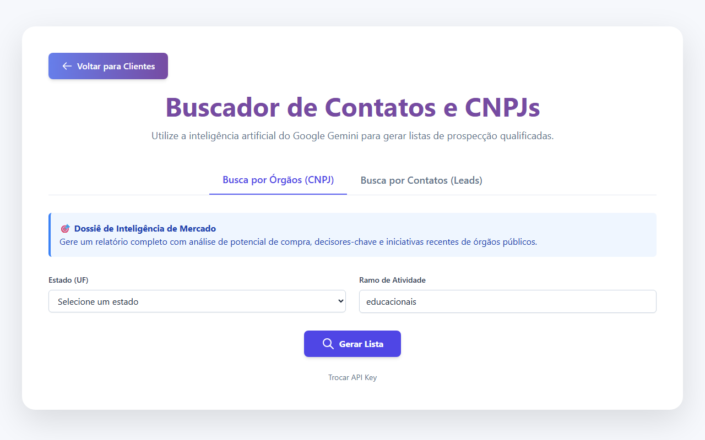

### Passo 3: Definindo o Que Queremos
Escolhemos "Bahia" e "Escola Estadual". Veja como o sistema já organiza tudo por categorias.

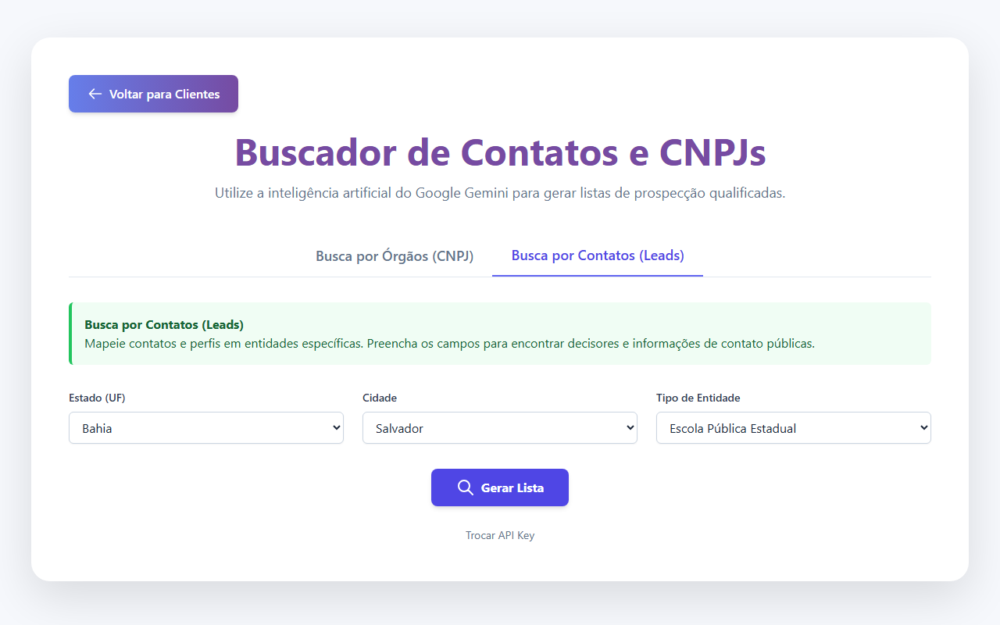

### Passo 4: A Mágica da IA com Busca de Leads
**Agora usando a funcionalidade correta:** Em vez de buscar apenas órgãos, nossa IA foca em **leads** - pessoas e contatos reais dentro das escolas.

Em poucos segundos, nossa IA trouxe uma lista de escolas reais da Bahia, mas agora com um diferencial: **informações sobre corpo docente, coordenação pedagógica e gestão**. Cada resultado já vem com dados estratégicos para a abordagem comercial.

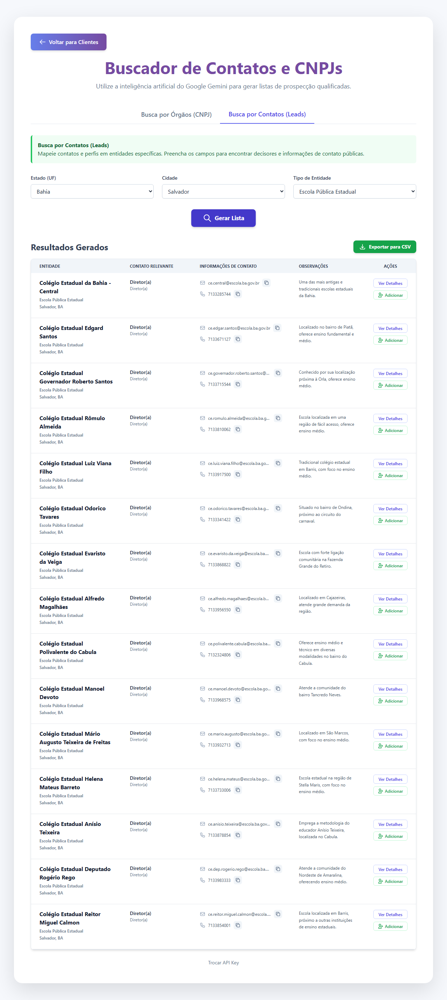

### Passo 5: Salvando o Lead como Cliente
Encontramos uma escola interessante e queremos convertê-la em cliente? Um clique e pronto - ela já entra na nossa base de dados.

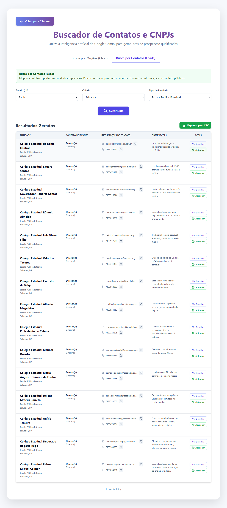

### Passo 6: Confirmação e Controle
O sistema confirma que a operação foi bem-sucedida. Agora temos um lead quente que virou cliente na nossa base.

### Resultado Final: Cliente Qualificado na Base
Missão cumprida! O que antes demandava uma manhã inteira de pesquisa manual em sites de escolas, agora levou apenas alguns cliques. E o melhor: **com informações de corpo docente que facilitam a abordagem comercial**.

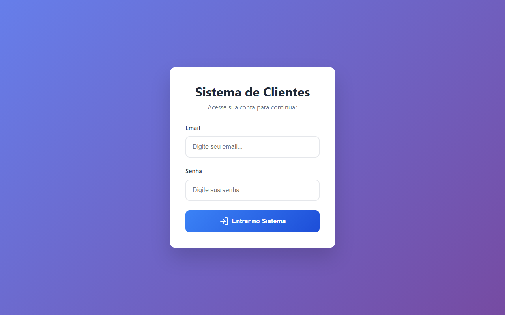

---

## Por Que Isso Faz Diferença?

**Antes:** Vendedor gastava horas no Google procurando contatos, anotando em caderno, sem histórico.

**Agora:** IA entrega lista qualificada em minutos, sistema guarda tudo organizado, gestor acompanha em tempo real.

**Resultado:** Mais tempo vendendo, menos tempo pesquisando. Mais controle, menos improviso.

---

## ✨ Novidades Implementadas

### 🎯 Busca de Leads Aprimorada
- **Foco em Pessoas:** Não apenas órgãos, mas contatos reais (diretores, coordenadores)
- **Corpo Docente:** Informações sobre equipe pedagógica para facilitar abordagem
- **Mais Resultados:** Até 60 escolas por busca (antes eram 50)

### 🧠 Inteligência Aprimorada
- **Informações Estratégicas:** Coordenação pedagógica, metodologias, infraestrutura
- **Contatos Qualificados:** Nome, cargo e informações de contato dos decisores
- **Contexto Pedagógico:** Dados sobre o projeto educacional da escola

### 💾 Integração Completa
- **Conversão Direta:** Leads se transformam em clientes com um clique
- **Histórico Preservado:** Todas as informações da prospecção ficam salvas
- **Acompanhamento:** Gestor vê de onde cada cliente veio
